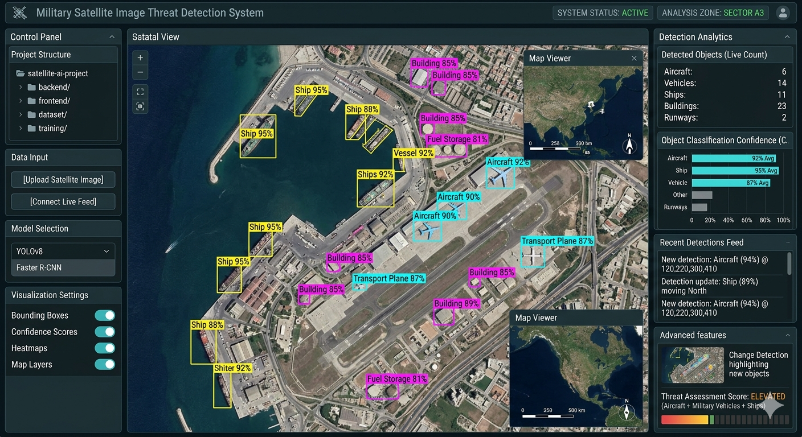

# Military Satellite Image Threat Detection



A **Satellite Image Threat Detection System** is a very strong ML project because it combines **computer vision, geospatial data, vision language modal to count the objects, and an intelligence-style dashboard**. Systems like this are used by organizations such as National Aeronautics and Space Administration and National Geospatial-Intelligence Agency to analyze imagery.

Below is a deeper explanation of how you can build it using **Python + ML + React (Vite)**.

---

# Installation 

Add your env. 

```bash
SECRET_KEY=""
DATABASE_PASSWORD=""
DATABASE_NAME="satelliteAnalysis"
ENCRYPTION_KEY=''
```

# 1. What the System Does

The system takes a **satellite image** and automatically detects objects such as:

* Aircraft
* Ships
* Vehicles
* Buildings
* Runways
* Military bases (pattern detection)

The AI model draws **bounding boxes** around detected objects and assigns **confidence scores**.

Example output:

| Object   | Confidence |
| -------- | ---------- |
| Aircraft | 92%        |
| Vehicle  | 87%        |
| Ship     | 95%        |

---

# 2. System Architecture

### Frontend

React + Vite dashboard

Functions:

* upload satellite image
* visualize detections
* show object statistics
* map viewer

Libraries:

* **React**
* **Leaflet / Mapbox**
* **Three.js (optional)**

---

### Backend

Python API using:

* FastAPI or Flask
* ML inference
* image processing

Responsibilities:

1. Receive image
2. Run ML detection
3. Return bounding boxes + labels

Example JSON response:

```json
{
 "detections":[
  {
   "object":"aircraft",
   "confidence":0.94,
   "bbox":[120,220,300,410]
  },
  {
   "object":"vehicle",
   "confidence":0.87,
   "bbox":[400,150,460,200]
  }
 ]
}
```

---

# 3. Machine Learning Models

You will train an **object detection model**.

Popular models include:

* YOLOv8
* Faster R-CNN

### Why YOLOv8

Advantages:

* fast
* accurate
* easy to train
* works well for satellite objects

---

# 4. Datasets for Training

You need satellite datasets with **labeled objects**.

### xView Dataset

Provided by Defense Innovation Unit.

Contains:

* 1 million objects
* 60 object classes

Examples:

* tanks
* trucks
* aircraft
* ships

Dataset:
xView Dataset

---

### SpaceNet Dataset

Dataset by:

SpaceNet

Focus:

* buildings
* roads
* infrastructure

Dataset:
SpaceNet Dataset

---

# 5. Training Pipeline

Typical workflow:

### Step 1

Download satellite dataset.

### Step 2

Convert labels into YOLO format.

Example label file:

```
aircraft 0.45 0.67 0.12 0.10
vehicle 0.25 0.33 0.05 0.06
```

---

### Step 3

Train model

Example Python training code:

```python
from ultralytics import YOLO

model = YOLO("yolov8n.pt")

model.train(
    data="satellite.yaml",
    epochs=50,
    imgsz=640
)
```

---

### Step 4

Inference

```python
results = model("satellite_image.jpg")

for r in results:
    boxes = r.boxes
```

---

# 6. Backend API (Python)

Example with **FastAPI**

```python
from fastapi import FastAPI, UploadFile
from ultralytics import YOLO
import cv2

app = FastAPI()

model = YOLO("best.pt")

@app.post("/detect")
async def detect(file: UploadFile):

    image_bytes = await file.read()

    with open("temp.jpg","wb") as f:
        f.write(image_bytes)

    results = model("temp.jpg")

    detections = []

    for r in results:
        for box in r.boxes:

            detections.append({
                "class": int(box.cls),
                "confidence": float(box.conf),
                "bbox": box.xyxy.tolist()
            })

    return {"detections": detections}
```

---

# 7. React Frontend

React dashboard features:

### Image Upload

```javascript
const uploadImage = async () => {

 const formData = new FormData();
 formData.append("file", image);

 const res = await fetch("/detect",{
  method:"POST",
  body:formData
 });

 const data = await res.json();

 setDetections(data.detections);
};
```

---

### Display Bounding Boxes

Use:

* canvas
* react-konva

Draw bounding boxes around objects.

---

# 8. Dashboard Features

Your dashboard can include:

### Detection Panel

Shows detected objects.

Example:

```
Aircraft: 3
Vehicles: 12
Ships: 2
```

---

### Confidence Visualization

Bar chart using:

* Chart.js
* Recharts

---

### Map View

Show geospatial coordinates.

Libraries:

* Leaflet
* Mapbox

---

# 9. Advanced Features (Very Impressive)

If you want the project to look **extremely advanced**, add:

### 1. Change Detection

Detect new objects between two satellite images.

Use **image differencing**.

---

### 2. Multi-object tracking

Track objects across satellite frames.

---

### 3. Threat Scoring System

Example:

```
Threat Score = Aircraft + Military Vehicles + Ships
```

---

### 4. AI Report Generator

Automatically produce a report:

```
Detected 2 aircraft and 6 vehicles in sector A3.
Potential high activity zone.
```

---

# 10. Example Project Structure

```
satellite-ai-project

backend
  app.py
  model
  utils

frontend
  src
  components
  pages
  dashboard

dataset
training
```

---

# 11. What Makes This Project Very Powerful

This project demonstrates:

* **Computer Vision**
* **Geospatial AI**
* **Fullstack ML deployment**
* **React visualization**
* **Real-world intelligence-style systems**

It is similar to systems used in:

* Lockheed Martin
* Palantir Technologies

---

# 12. What Recruiters Will Like

This project proves you know:

* ML model training
* deploying AI models
* building data dashboards
* handling large image data
* integrating Python + React

---

✅ If you want, I can also show you:

* **How to build a military-style satellite intelligence dashboard UI**
* **Where to download real satellite images**
* **How to label your own satellite dataset**
* **How to reach 90% detection accuracy**
* **How intelligence agencies detect military bases using AI**

The **architecture can become extremely powerful** if designed well. 🚀
